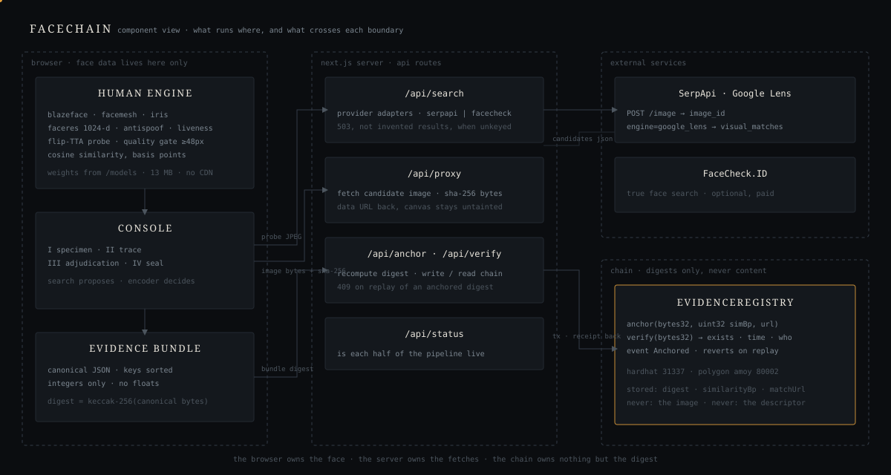

# Architecture

Facechain is a single-page Next.js 16 app that captures a face in the browser, asks a
live image-search backend where that face appears on the public web, re-verifies every
candidate biometrically with the same encoder that read the probe, and seals the
accepted match to a blockchain as a keccak256 digest of a canonical evidence bundle.
The pipeline is four stations on one page; two of them run in the browser, two on the
server, and the last one ends on a chain. The important structural decision is that the
search backend never gets to declare a match — it only proposes candidates, and the
face encoder decides.

## Trust boundaries and the four stations

Three trust domains: the browser (face data lives here and only here), the Next.js
server (API routes that talk to search backends and the chain), and the chain (holds
digests, never content). The component view:

### Station I — Specimen (browser)

`src/lib/human-client.ts` holds one lazily-loaded `@vladmandic/human` instance for the
whole session, configured with blazeface detection (rotation on, single face),
facemesh, iris, `faceres` description (the 1024-dimension embedding), antispoof, and
liveness. Model weights are served from `public/models` (13 MB), so nothing is fetched
from a CDN and no face data leaves the machine at this stage.

The descriptor that gets committed to the evidence bundle comes from
`readFaceStable()`: it encodes the frame and a horizontally mirrored copy, then
averages the two descriptors. This flip test-time augmentation is standard evaluation
practice in the face-recognition literature (ArcFace, Deng et al., CVPR 2019, evaluates
with flip averaging); it cancels pose asymmetry and makes the probe descriptor
noticeably more stable between captures. The live preview loop stays single-pass —
TTA doubles inference cost, which is worth paying once for the probe but not thirty
times a second for an overlay. If the mirror pass fails for any reason, the code falls
back to the single-pass reading rather than erroring.

`frameToJpeg()` scales the capture so the longest edge is 900 px at JPEG quality 0.86,
which keeps the upload under SerpApi's 500 KB ceiling.

### Station II — Trace (server)

`src/lib/providers/` is an adapter layer: one `SearchProvider` interface
(`search(image, mime) → SearchOutcome`), two implementations, and a registry in
`index.ts`. `SEARCH_PROVIDER` picks the backend by name; otherwise the first provider
holding credentials wins. When nothing is configured, `/api/search` returns 503 with a
plain message instead of inventing results.

**SerpApiLens** (`serpapi.ts`, default) is a two-step call, because Google Lens will
not accept raw bytes: POST the probe to `serpapi.com/image` to obtain an `image_id`,
then run `engine=google_lens` against that id — no third-party image host involved.
If the default response carries no `visual_matches`, it retries once with
`type=visual_matches` explicitly, since SerpApi has shipped both response shapes and an
empty Adjudication station is worse than spending a second search.

**FaceCheckId** (`facecheck.ts`) is a true face-embedding search: `upload_pic` to get
an `id_search`, then poll `search` every 2.5 s (up to 120 s) until `output` appears.
It returns the matched crop inline as a data URL. It is paid, in credits, which is why
Lens stays the default.

Both providers sort social-platform hosts (the list in `types.ts`) to the front of the
candidate list; `/api/search` caps the response at 24 candidates and includes the
probe's sha256.

### Station III — Adjudication (browser again)

This station makes the search defensible. Each candidate image is fetched through
`/api/proxy`, which retrieves the bytes server-side (browser-shaped User-Agent first,
then a retry with the image's own origin as Referer for hotlink-protected CDNs), hashes
them with sha256 — this server-side hash is the authoritative digest that goes into the
bundle — and returns them as a data URL so the canvas stays untainted and the browser
can run the encoder on the pixels.

The candidate face is then re-encoded by the *same* Human instance that produced the
probe descriptor, so the similarity number compares like with like. Before scoring,
`passesQualityGate()` refuses candidates whose face is under 48 px on its shorter side
or whose detector score is under 0.45: cosine similarity on face embeddings degrades
sharply at low resolution — small crops drift toward the mean face and inflate false
matches — so those candidates are shown with the refusal reason instead of a
misleading score.

Scoring is `cosineSimilarityBp()` in `src/lib/canonical.ts`: plain cosine similarity,
clamped to [0, 1], returned as an integer in basis points. Measured calibration on the
bundled encoder (four public-domain portraits, reproducible at `/selftest` without any
API key): same-person pairs score ≥ 57.71, different-person pairs ≤ 44.88, and the
default threshold of 54 sits in the gap between the two groups. The threshold is
exposed as a dial in the console and rejected candidates keep their scores visible, so
the decision can be inspected rather than taken on faith.

### Station IV — Seal (server + chain)

The accepted match is folded into a canonical evidence bundle (next section).
`canonicalJson()` serializes it with object keys sorted at every depth and no
insignificant whitespace; every field is a string or an integer, similarity is stored
in basis points, and there are deliberately no floats — a float that round-trips
through JSON on a different runtime can serialize differently and would silently break
re-verification. `keccak256` of those canonical bytes is the digest.

`/api/anchor` first calls `verify(digest)` on the contract and returns 409 if the
digest already exists (a clear message beats a raw revert), then submits
`anchor(bytes32 bundleHash, uint32 similarityBp, string matchUrl)` and waits for the
receipt. The contract (`chain/contracts/EvidenceRegistry.sol`, ~70 lines) reverts
`AlreadyAnchored` on replay and `SimilarityOutOfRange` above 10000 bp; it keeps an
append-only digest log for enumeration and emits an `Anchored` event.
`verify(bytes32)` returns `(exists, timestamp, submitter, similarityBp)`.

`src/lib/chain.ts` selects the network: local Hardhat (chain id 31337, viem wallet
falls back to Hardhat's well-known account 0) is the default; `CHAIN_TARGET=amoy`
switches to Polygon Amoy (chain id 80002) with a `DEPLOYER_PRIVATE_KEY` from
`.env.local`. Same contract, same code path.

Only the digest, the similarity score, and the matched URL go on chain. The probe
image and the descriptor never do.

## The evidence bundle

`EvidenceBundle` in `src/lib/canonical.ts`:

| field | meaning |
|---|---|
| `v` | bundle schema version, literal `1` |
| `probeImageSha256` | sha256 of the probe JPEG bytes |
| `probeDescriptorSha256` | sha256 of the probe descriptor, quantized to fixed-point ints (×10000, rounded) so the digest is stable across platforms |
| `matchUrl` | URL of the matched post |
| `matchSource` | host the match came from, e.g. `instagram.com` |
| `matchTitle` | page title reported by the search provider |
| `matchImageSha256` | sha256 of the matched image bytes as fetched by `/api/proxy` |
| `similarityBp` | face similarity in basis points, 0..10000, integer |
| `encoder` | which encoder produced both descriptors (`human/blazeface+facemesh+faceres`) |
| `provider` | which search backend found the match (`serpapi:google_lens` or `facecheck.id`) |
| `capturedAt` | unix seconds when the probe was captured |

Anchor: `bundleDigest(bundle)` = `keccak256(canonicalJson(bundle))` →
`anchor(digest, similarityBp, matchUrl)` → tx receipt with block number and gas.

Verify: hand the bundle back to `/api/verify`, which recomputes the digest from the
canonical serialization and asks the contract. Because the digest is derived from the
content, verification needs no record id — the bundle *is* the key.

Tamper demonstration (the console has a button for it): edit any single field —
`verify-chain.mjs` flips `similarityBp` from 7314 to 7313 — and the recomputed digest
is a different bytes32, so `verify` returns `exists: false`. The bundle was either
never sealed or has been altered; the chain cannot tell which, and the UI says so.

## Why this shape

**Search proposes, encoder decides.** Google Lens matches whole images, not faces, so
its candidates are lookalikes, reused photos, and stock imagery alongside real hits.
Re-encoding every candidate with the same instance that read the probe converts "Lens
thinks these pages look similar" into "the face encoder measured this specific
similarity" — a claim the evidence bundle can actually carry.

**Hash-only anchoring.** Putting the image or descriptor on a public chain would be a
privacy failure and a gas bill. A keccak256 digest is 32 bytes, reveals nothing, and
proves everything the record needs to prove: that the bundle has not changed.

**Provider adapter.** Lens is free-tier-friendly but weak at faces; FaceCheck.ID is a
real face-embedding search for anyone who pays. One interface and an env variable keep
that a configuration choice rather than a rewrite.

**Local-first models.** The weights ship in `public/models`, so the face engine works
offline and no face data reaches any third party until the operator deliberately runs
the trace.

## Verifying it

`node scripts/verify-chain.mjs` (app on :3000, Hardhat node on :8545, contract
deployed) runs five checks against the real API routes:

1. Anchor a fixed bundle — expects status 200 with digest, tx hash, block, gas.
2. Verify the untouched bundle — `onChain: true`, digest matches the sealed one.
3. Verify with `similarityBp` 7314 → 7313 — `onChain: false`.
4. Verify with the bundle's key order reversed — digest identical to the sealed one.
   This is the check that matters most: it proves canonicalization is
   order-independent, so re-verification does not depend on how the JSON happened to
   be written.
5. Re-anchor the same bundle — status 409, refused.

The encoder half is checked at `/selftest`, no API key required: four public-domain
portraits (two of the same person) go through `/api/proxy` and the encoder, and
same-person pairs must outscore every different-person pair. Measured on this build:

| pair | expected | similarity |
|---|---|---|
| obama-a ↔ obama-b | same person | **57.71** |
| merkel ↔ watson | different | 44.88 |
| obama-a ↔ watson | different | 41.46 |
| obama-a ↔ merkel | different | 40.90 |
| obama-b ↔ watson | different | 38.91 |
| obama-b ↔ merkel | different | 30.66 |

## Known limits

Google Lens is not a face search — it finds well-indexed public figures and often
nothing for a private individual; Station III exists precisely because its candidates
cannot be trusted as matches. The 1024-d `faceres` encoder is good, not state of the
art: expect trouble with heavy occlusion, extreme pose, low light, and large age gaps,
which is why the threshold is a dial and every rejected score stays visible. The chain
proves integrity, not truth — an anchored digest shows the bundle is unaltered since
sealing, not that the match was correct, and the UI keeps those claims separate.
Anchoring transactions are signed server-side with a key from `.env.local`, a
deliberate demo choice (one less thing to fail on camera); it means the on-chain
submitter is the server, not the operator, and a production build would connect a
wallet. Some hosts (Instagram in particular) block server-side image fetches; those
candidates are marked skipped with the reason. Anti-spoof and liveness scores are
displayed but nothing gates on them.
