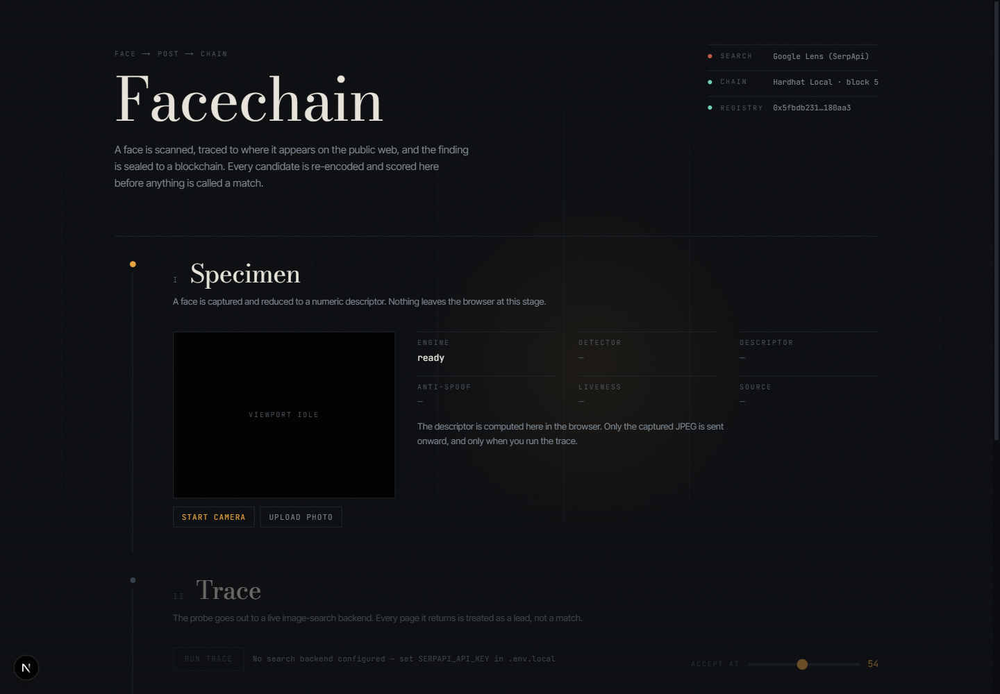
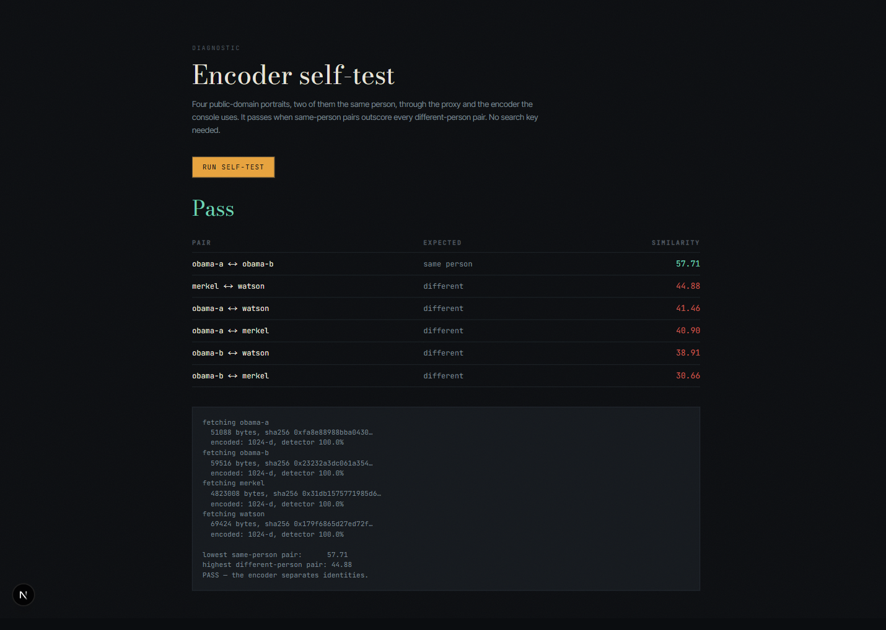

# Facechain

> **Cryptographic Face Trace & Blockchain Registry**  
> Scan a face, trace where it appears on the public web and social media, and seal the finding onto a blockchain as an immutable, tamper-evident record.

```
face scan  ─▶  web / social trace  ─▶  in-browser re-encode  ─▶  keccak256  ─▶  on-chain seal  ─▶  re-verify
```

Built for **Hackers House Goa 2026 Shortlisting Task 3: Face Identification & Blockchain Verification**.

---

## Documentation Quick Links

- **[SETUP.md](SETUP.md)** — Step-by-step setup guide (local Hardhat, Sepolia testnet, and Amoy).
- **[ARCHITECTURE.md](ARCHITECTURE.md)** — Complete architectural blueprint, trust boundaries, and math.

---

## Visual Overview



The pipeline is split into four distinct stations operating across three security perimeters (Browser Client $\leftrightarrow$ Next.js Server $\leftrightarrow$ Blockchain Ledger).



---

## The Four Stations

The entire pipeline executes on a single interactive cyber-industrial console:

### Station I — Specimen (Browser Client)
- **Zero-Trust Privacy**: Face detection and feature extraction run 100% client-side in the browser using WebGL and TensorFlow.js via [`@vladmandic/human`](https://github.com/vladmandic/human).
- **Local Model Weights**: All 13 MB of model shards are served directly from `public/models/`. No webcam frames, user photos, or biometric vectors are ever sent to external CDNs or backends.
- **Neural Pipeline**:
  - **Detector**: BlazeFace locates bounding coordinates.
  - **Mesh & Geometry**: MediaPipe FaceMesh maps 468 3D facial landmarks and evaluates iris orientation.
  - **Feature Extractor**: FaceRes produces a **1024-dimensional deep unit vector descriptor**.
  - **Anti-Spoof & Liveness**: Dual classification heads verify genuine 3D human presence.
- **Flip Test-Time Augmentation (TTA)**: Probe capture averages the descriptor of the original frame with its horizontally mirrored image (`readFaceStable()`), cancelling out lighting and head-pose asymmetry (standard practice from ArcFace literature).

### Station II — Trace (Server Route)
- The probe JPEG is sent to the `/api/search` route, which delegates to an extensible provider adapter (`src/lib/providers/`).
- **Default Backend**: Google Lens via SerpApi (`SerpApiLens`). Handles binary upload and extracts live search leads, sorting recognized social platforms (Instagram, X, LinkedIn, Reddit, YouTube, TikTok) to the top of the queue.
- **Alternative Backend**: [FaceCheck.ID](https://facecheck.id/) (`FaceCheckId`) is supported out-of-the-box for paid, true facial-embedding search.
- **Guiding Principle**: The search backend only *proposes* candidate leads; it is never permitted to declare a match.

### Station III — Adjudication (Browser Client)
- **Authoritative Server Proxy**: Each candidate image is fetched through `/api/proxy`. The proxy evades CDN hotlinking via fallback Referer headers, prevents browser canvas taint (CORS), streams image bytes, and computes an authoritative `SHA-256` hash.
- **Identical Basis Re-Encoding**: Candidate images are decoded into HTML5 Image objects in the browser and re-encoded using the **exact same model instance** that encoded the specimen.
- **Quality Gating**: Low-resolution crops (<48 px) and uncertain detections are skipped with transparent reasons to prevent false matches from centroid drift.
- **Cosine Similarity in Basis Points**: Cosine similarity is computed and scaled to integer basis points (0–10000). The default threshold of **54.00% (5400 bp)** was empirically calibrated using the `/selftest` portrait suite.

### Station IV — Seal & Verify (Server + Blockchain)
- **Canonical Evidence Bundle**: The winning match is assembled into an idempotent JSON structure (`v: 1`, probe image SHA-256, quantized descriptor SHA-256, match URL, match image SHA-256, similarity bp, encoder tag, provider tag).
- **Zero Floats & Key Sorting**: Serialized using `canonicalJson()` (keys recursively sorted, no whitespace, zero floating-point numbers) to eliminate cross-platform serialization divergence.
- **32-Byte Keccak-256 Anchor**: Only the 32-byte digest is written to the smart contract (`EvidenceRegistry.sol`). Raw images and vectors never touch the chain, preserving privacy and saving thousands of dollars in gas.
- **Replay Protection**: Replaying identical bundles is refused on-chain (`AlreadyAnchored`) and surfaced cleanly in the UI as a pre-anchored record with historical transaction links.
- **Live Tamper Demonstration**: Re-verifying re-hashes the bundle and checks the contract. Toggling "Alter the bundle first" modifies `similarityBp` by just 1 basis point (0.01%), causing the Keccak-256 hash to completely diverge and the contract to reject the record.

---

## Supported Blockchains

Facechain is multi-chain ready out of the box. Switching networks requires changing a single environment variable (`CHAIN_TARGET`) in `.env.local`:

| Network | Chain ID | Target Value | Explorer | Ideal For |
|---|:---:|:---:|---|---|
| **Hardhat Local** *(Default)* | `31337` | `localhost` | Local RPC (`127.0.0.1:8545`) | Zero-config, instant local testing |
| **Ethereum Sepolia** *(Recommended)* | `11155111` | `sepolia` | [sepolia.etherscan.io](https://sepolia.etherscan.io/) | Public testnet with live Etherscan receipts |
| **Polygon Amoy** | `80002` | `amoy` | [amoy.polygonscan.com](https://amoy.polygonscan.com/) | Low-cost high-throughput public testnet |

---

## Quickstart: Running Locally

### 1. Install Dependencies
```bash
# Root Next.js application
npm install

# Hardhat blockchain project
cd chain && npm install && cd ..
```

### 2. Configure Environment Variables
Copy `.env.example` to `.env.local`:
```bash
cp .env.example .env.local
```

Add your free [SerpApi Key](https://serpapi.com/manage-api-key) (free tier includes 250 searches/month):
```ini
SERPAPI_API_KEY=your_serpapi_key_here
CHAIN_TARGET=localhost
```

### 3. Launch Local Blockchain & Dev Server
Run each command in a separate terminal:

```bash
# Terminal 1: Start local Ethereum node (Chain ID: 31337)
npm run chain:node

# Terminal 2: Deploy EvidenceRegistry smart contract
npm run chain:deploy

# Terminal 3: Start Next.js development server
npm run dev
```

Open **`http://localhost:3000`** in your browser.

---

## Deploying to Ethereum Sepolia Testnet

To anchor evidence to the public Ethereum Sepolia network:

1. Obtain free SepoliaETH from [Google Cloud Sepolia Faucet](https://cloud.google.com/application/web3/faucet/ethereum/sepolia) or [Sepolia PoW Faucet](https://sepolia-faucet.pk910.de/).
2. In `.env.local`, set:
   ```ini
   CHAIN_TARGET=sepolia
   DEPLOYER_PRIVATE_KEY=0xYOUR_THROWAWAY_PRIVATE_KEY
   ```
3. Deploy the contract to Sepolia:
   ```bash
   npm run chain:deploy:sepolia
   ```
4. Start the dev server (`npm run dev`). Sealed records will now generate live transactions verifiable on [sepolia.etherscan.io](https://sepolia.etherscan.io/)!

---

## Verification & Self-Testing

### 1. Standalone On-Chain Verification CLI (Direct RPC)
To verify contract state, inspect anchored records, and test on-chain tamper rejection directly over JSON-RPC (without running Next.js):

```bash
npm run verify:direct
```
Or for Ethereum Sepolia:
```bash
CHAIN_TARGET=sepolia npm run verify:direct
```

### 2. Full Integration Test Suite (API + Smart Contract)
With your node running and contract deployed:

```bash
npm run verify:chain
```

**Expected Output**:
```
1. ANCHOR                                       status 200
2. VERIFY (untouched)                           onChain: true
3. VERIFY (similarityBp 7314 -> 7313)           onChain: false
4. VERIFY (key order shuffled, same data)       digest identical to sealed: true
5. RE-ANCHOR same bundle                        status 409, refused
ALL CHAIN CHECKS PASSED
```

### 3. Offline Face Engine Diagnostic (`/selftest`)
Navigate to `http://localhost:3000/selftest`.

Tests four public-domain portraits (Obama, Merkel, Watson) through the local encoder without API keys. Validates that same-person pairs ($\ge 57.71\%$) cleanly outscore different-person pairs ($\le 44.88\%$).



---

## Project Structure

```
facechain/
├── ARCHITECTURE.md          # In-depth architectural blueprint and trust models
├── SETUP.md                 # Detailed deployment and configuration manual
├── chain/                   # Hardhat blockchain workspace
│   ├── contracts/
│   │   └── EvidenceRegistry.sol  # Solidity 0.8.24 tamper-evident registry
│   ├── scripts/deploy.js    # Multi-chain deployment script
│   └── hardhat.config.js    # Hardhat networks & compiler configuration
├── public/models/           # 13 MB local model weights (BlazeFace, Mesh, FaceRes)
├── scripts/
│   ├── verify-chain.mjs     # API integration verification test
│   └── verify-direct-chain.mjs # Direct on-chain JSON-RPC verification script
└── src/
    ├── app/
    │   ├── api/
    │   │   ├── anchor/      # Keccak-256 hashing and on-chain anchoring
    │   │   ├── proxy/       # CORS bypass, byte streaming, and SHA-256
    │   │   ├── search/      # Live web & social media search dispatch
    │   │   ├── status/      # Real-time chain and provider telemetry
    │   │   └── verify/      # Canonical re-hashing and on-chain lookup
    │   ├── page.tsx         # Client-only entry point
    │   └── selftest/        # Offline diagnostic page
    ├── components/
    │   ├── Docket.tsx       # Main 4-station reactive console
    │   ├── Specimen.tsx     # Webcam capture, landmark overlay, and TTA
    │   └── ...              # UI primitives (ThresholdDial, HashStrip, etc.)
    └── lib/
        ├── canonical.ts     # Canonical JSON, Keccak-256, Cosine Similarity
        ├── chain.ts         # Viem clients and multi-chain configuration
        ├── human-client.ts  # Browser ML runtime singleton (@vladmandic/human)
        └── providers/       # Search backend adapter (Google Lens, FaceCheck)
```

---

## Known Limitations & Honest Disclosures

1. **Google Lens is an Image Search, not a Face Search**: Google Lens matches entire images (clothing, background, poses). It reliably finds indexed celebrities and social figures, but may return few results for private individuals. Station III (Adjudication) was specifically engineered to counteract this: the search engine proposes leads, but only the face encoder decides.
2. **Server-Side Transaction Signing**: For demo convenience and reliable live recording, transactions are signed server-side using a key in `.env.local`. A production enterprise deployment would integrate an in-browser wallet (e.g. MetaMask / WalletConnect).
3. **Instagram & Hotlinking Protection**: Certain social media CDNs aggressively block automated image scrapers. When an image cannot be retrieved, Facechain displays a clear "skipped" status rather than failing silently.
4. **Integrity vs. Truth**: The blockchain proves that the evidence bundle has not been modified since the timestamp of the block. It proves data integrity; it does not claim to prove legal identity.

---

## Technology Stack

- **Frontend**: Next.js 16 (App Router), React 19, TypeScript, Tailwind CSS v4, Motion (Framer Motion).
- **Client ML Runtime**: [`@vladmandic/human`](https://github.com/vladmandic/human) (TensorFlow.js WebGL backend, BlazeFace, MediaPipe FaceMesh, FaceRes).
- **Blockchain & Web3**: Solidity 0.8.24, Viem, Hardhat, Ethereum Sepolia, Polygon Amoy.
- **Search Providers**: SerpApi (Google Lens), FaceCheck.ID.

---

## License

MIT License. Developed for **Hackers House Goa 2026**.
